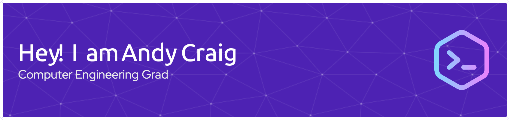

<h1 align="center">Hi 👋, I'm Andy Craig</h1>
<h3 align="center">A junior software engineer, with a knack for ML Infra and iOS applications.</h3>

- 🌱 I’m currently learning **Javascript and Kubernetes**

- 👨‍💻 Lead developer of [Cactusapp](https://github.com/Cactus-org/CactusFB), an app to provide small businesses with their own loyalty program. Site link [here](https://www.cactusapp.ca).

- 🏋️‍♀️ I recently completed [WorkoutPal](https://github.com/AndyCraig200/workoutPal-iOS), an AI workout analysis tool that can perform repetition counting, exercise detection through video and caloric estimates. 

- 👨‍💻 Technical Experience with GCP, ML Infrastructure, Training and Evaluating ML Models, and general software engineering principles.  

- 📫 How to reach me **andycraig200@gmail.com**

<h3 align="left">Connect with me:</h3>
- <a href="https://www.linkedin.com/in/andycraig200/">LinkedIn</a>

<h3 align="left">Languages and Tools:</h3>
                </a>  
